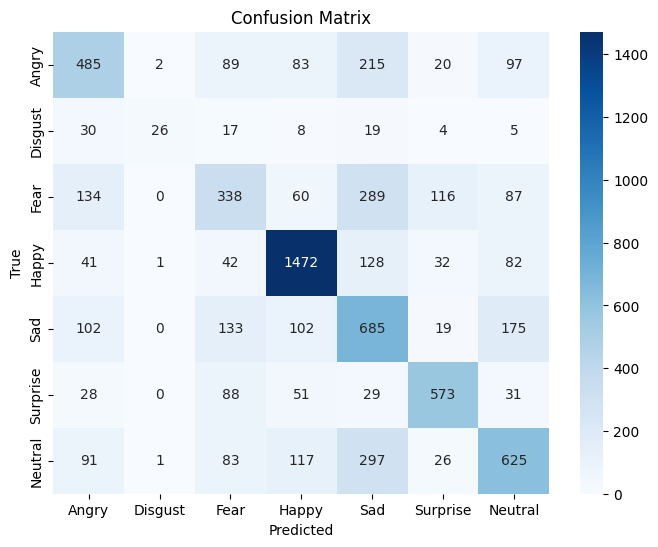
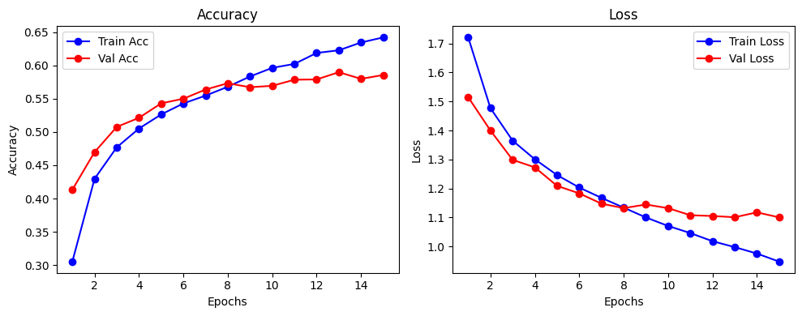
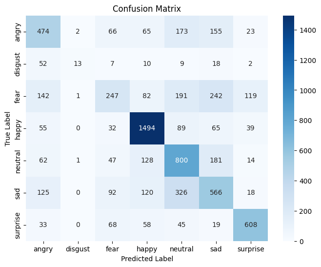
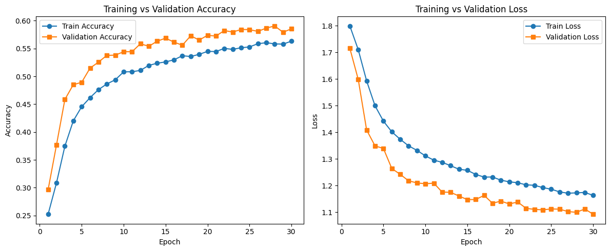

# 😊 Facial Emotion Recognition using CNN

This project focuses on Facial Emotion Recognition (FER) using Convolutional Neural Networks (CNN) applied to the FER-2013 dataset. Two different approaches are implemented and compared:

- 📊 CSV-Based Approach: The dataset is provided as a CSV file with pixel values.  
- 🖼️ Image-Based Approach: The dataset is provided as structured image folders (train/test).

---

## 📌 Goals

- Train CNN models to classify facial expressions into 7 emotions.
- Compare model performance between CSV-based and image-based training pipelines.
- Evaluate classification results and visualize confusion matrices.

---

## 📁 Dataset

The FER-2013 dataset was used in this project. It contains 48x48 grayscale images of human faces, each labeled with one of seven emotions:

- 😠 Angry  
- 🤢 Disgust  
- 😨 Fear  
- 😊 Happy  
- 😢 Sad  
- 😲 Surprise  
- 😐 Neutral  

Two versions of the dataset were used:

- 📊 CSV-Based: Contains pixel values in a single CSV file (fer2013.csv), with emotion labels and image data as strings. ([Kaggle - deadskull7/fer2013](https://www.kaggle.com/datasets/deadskull7/fer2013))  
- 🖼️ Image-Based: Contains pre-organized image folders (train/ and test/) with separate directories for each emotion. ([Kaggle - msambare/fer2013](https://www.kaggle.com/datasets/msambare/fer2013))

---

## 🧠 Model Architecture & Training

### 📊 CSV-Based Model
- Preprocessing: Normalized pixel values from the CSV and reshaped into 48×48 grayscale images.  
- Architecture: Custom CNN built using Keras Sequential API.  
- Training: Trained for 15 epochs using Adam optimizer and categorical crossentropy loss.  
- Evaluation: Achieved ~59% accuracy on the test set. Evaluation included confusion matrix and classification report.

### 🖼️ Image-Based Model
- Preprocessing: Used ImageDataGenerator to load images from folders and apply data augmentation (rotation, shift, zoom, horizontal flip).  
- Architecture: Similar CNN model trained directly on 48×48 grayscale images.  
- Training: Trained for 30 epochs.  
- Evaluation: Also achieved ~59% accuracy. Evaluation done using confusion matrix and classification report.

---

## 📊 Results & Comparison

The following table summarizes the final classification performance of both approaches on the FER-2013 test set:

| Metric         | CSV-Based Model | Image-Based Model |
|----------------|------------------|--------------------|
| Accuracy       | 0.59             | 0.59               |
| Macro F1       | 0.52             | 0.51               |
| Weighted F1    | 0.58             | 0.57               |

- 📈 CSV-Based Model achieved slightly better macro and weighted F1-scores and performed more consistently across all emotion classes.
- 🖼️ Image-Based Model had similar accuracy but showed weaker performance on some underrepresented classes like *disgust*.

> Overall, both models showed promising results. The CSV-based model had a slightly more balanced performance.

---

## 🖼️ Visualizations

### 📊 CSV-Based Model
  

### 🖼️ Image-Based Model
  

---

## 🔗 Additional Resources

📘 To see the model outputs, training logs, and visualizations interactively, check out the full version of this notebook on Kaggle:  
👉 [View on Kaggle](https://www.kaggle.com/your-kaggle-notebook-link)

---

## ⚖️ License  
This project is licensed under the MIT License - see the [LICENSE](./LICENSE) file for details.

---

## 👩‍💻 Author  
Developed by Forough Ghayyem  
📫 [GitHub](https://github.com/foroughm423) | [LinkedIn](https://www.linkedin.com/in/forough-ghayyem/)